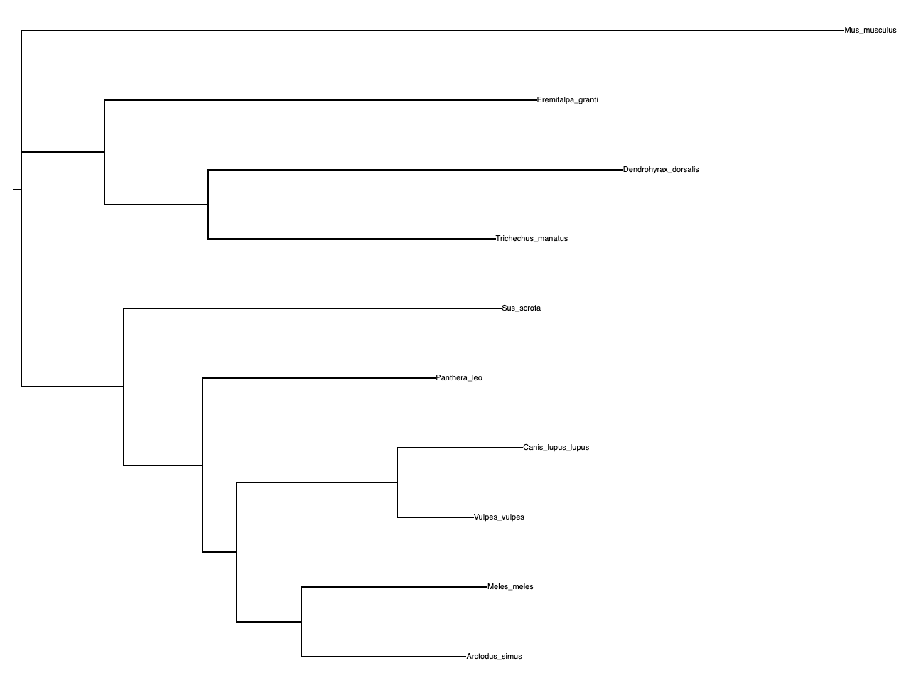

# EvoTrees

Plant phylogenetic trees based on 16S for specified species, or blastp-ed HBA1 aa sequence from different species.

# Requirements

- [muscle](https://anaconda.org/bioconda/muscle) (must be in ``$PATH`` as ``muscle``)
- [RAxML](https://github.com/stamatak/standard-RAxML) (must be in ``$PATH`` as ``raxml``)
- [ninja](http://nimbletwist.com/software/ninja/index.html) (must be in ``$PATH`` as ``ninja``)
- [biopython](https://biopython.org/) (``pip3 install -r requirements.txt``)

# Run

## 16S based on defined species

```bash
./phy.py 16S -f demo/species.txt -o 16S
```

Data will be under directory `16S` after execution, where trees will be planted at `16S/trees`.

## HBA1 blastp-ed, limited to 100 species

```bash
./phy.py HBA1 -l 100 -o HBA1
```

Data will be under directory `HBA1` after execution, where trees will be planted at `HBA1/trees`.

# Compare trees

## Requirements

To compare trees, module `robinson-foulds` is required:
- [robinson-foulds](https://pypi.org/project/robinson-foulds/)

But after installation, script should be edited as follow:

```python
t1 = Tree(args.treefile1, format=1)
t2 = Tree(args.treefile2, format=1)
  ```

## Run

```for tree in 16S/trees/*; do echo -n "$tree: "; rf species.nwk $tree; done```

Where `species.nwk` is real tree. Robinson-Foulds distances should be displayed as floats next to trees names.

# Example

```bash
# plant trees
./phy.py 16S -f demo/species.txt -o 16S

# robinson-foulds distance from real tree
for tree in 16S/trees/*; do echo -n "$tree: "; rf demo/species.nwk $tree; done

# output
16S/trees/tree_ml.nwk: 0.0
16S/trees/tree_mp.nwk: 0.3333333333333333
16S/trees/tree_nj.nwk: 0.16666666666666666
```

<html>
<body>
    <div>
        <h4>RAxML_bestTree.results</h4>
        <p>
            
        </p>
        <h4>Real tree from <a href="http://timetree.org/" target="_blank">TIMETREE</a></h4>
        <p>
            
        </p>
    </div>
</body>
</html>

